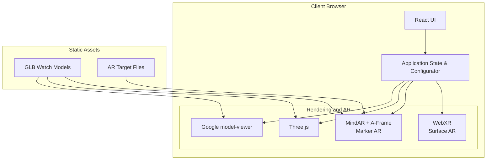

# WebAR Watch Store

WebAR Watch Store is a React and TypeScript web application for browsing watches through interactive 3D views and augmented reality.

## What it includes

- Interactive 3D watch viewing with orbit and zoom controls.
- Marker-based AR using MindAR and A-Frame.
- Markerless surface AR using WebXR when supported.
- A desktop 3D fallback for devices without AR hardware.
- Product catalogue, filtering, comparison, product details, and a guided configurator.

## High-level architecture



## Technology stack

| Layer | Technology | Purpose |
| :--- | :--- | :--- |
| Framework | React 18 + TypeScript | UI and application logic |
| Build tool | Vite | Development server and production builds |
| 3D rendering | Three.js | Custom 3D scenes and interactions |
| Product viewer | Google `<model-viewer>` | GLB rendering and AR launch support |
| Marker AR | MindAR + A-Frame | Image-target tracking |
| Styling | Vanilla CSS | Layout, responsive styles, and UI presentation |

## Project structure

```text
public/
├── models/          # Watch GLB assets
├── markers/         # MindAR targets
├── ar-marker-frame.html
└── marker.jpg

src/
├── components/
│   ├── ar/           # Marker and surface AR experiences
│   ├── catalogue/    # Product cards, filters, and highlights
│   ├── common/       # Shared navigation, footer, and modal UI
│   ├── configurator/ # Guided watch configuration flow
│   └── viewer/       # Interactive 3D viewer
├── data/             # Product and AR configuration data
├── pages/            # Catalogue, product, comparison, and AR pages
├── types/            # Shared TypeScript types
├── utils/            # WebXR helpers
├── App.tsx           # Application entry and routing
└── main.tsx          # React bootstrap
```

## Run locally

```bash
npm install
npm run dev
```

To create a production build:

```bash
npm run build
```

## AR requirements

Camera access and WebXR require HTTPS or `localhost`. Marker AR uses the target files in `public/markers`; surface AR requires a compatible mobile browser and device. Unsupported desktop devices use the 3D fallback.

## Watch assets

The catalogue currently includes Apple Watch Ultra 2, G-Shock Mudmaster, Cyber Horizon Digital, and Seiko Premier Automatic models. Their GLB files are stored in `public/models` and are shared by the 3D and AR experiences.
