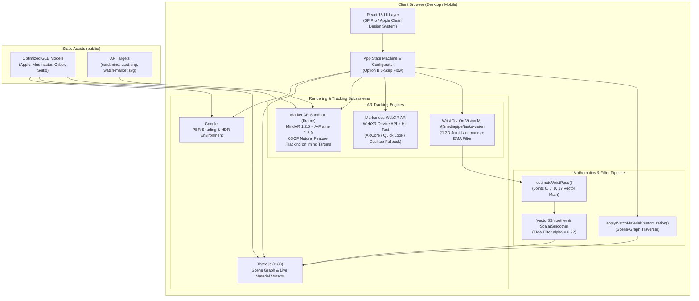
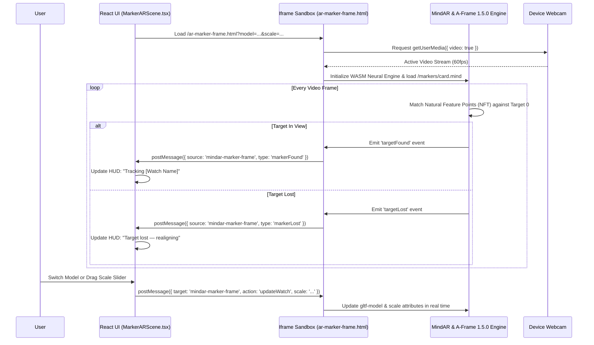
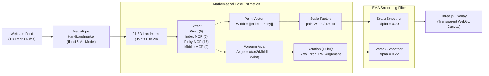
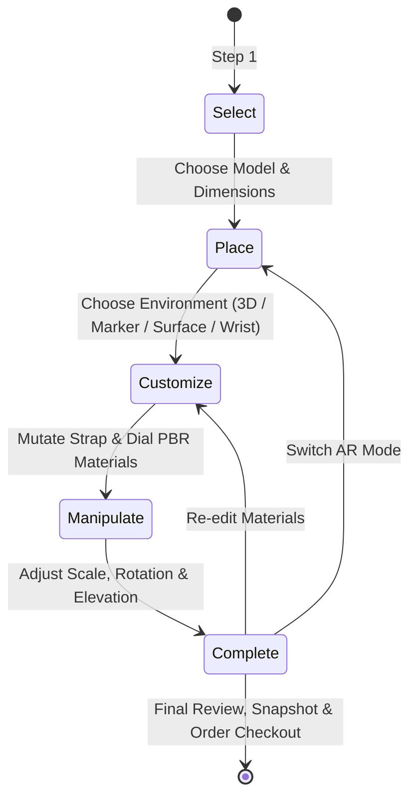

# WebAR Watch Store — Technical Architecture Document

## 1. Executive Summary & System Overview

**WebAR Watch Store** is a client-side Augmented Reality (AR) and 3D e-commerce web application engineered with **React 18, TypeScript, Vite, Three.js, Google `<model-viewer>`, MindAR / A-Frame 1.5.0, and MediaPipe Tasks Vision ML**.

### Core Problem Solved:
Online watch shopping historically suffers from high return rates because 2D photography cannot communicate true physical scale, wrist curvature ergonomics, metallic material reflectivity, or real-world lighting interaction. WebAR Watch Store addresses this by providing three complementary immersive visualization modalities:
1. **Interactive 3D Turntable:** 360° orbital inspection with PBR environment reflections, customizable strap/dial materials, and exploded/dimension views.
2. **Marker & Image Target 6DOF AR:** Pinned rigid 3D tracking on physical cards, packaging, or screen targets via MindAR GPU/WASM Natural Feature Tracking (NFT).
3. **Markerless WebXR Surface AR:** True 1:1 real-world surface placement on desks and floors using device SLAM and hit-testing (with desktop 3D ground-plane fallback).
4. **Virtual Wrist Try-On (ML-Powered):** Real-time on-device machine learning hand tracking that detects 21 3D hand joints and anchors the watch dynamically to the user's wrist with exponential smoothing.

---

## 2. High-Level System Architecture Diagram



---

## 3. Core Technology Stack

| Layer | Technology / Library | Version | Purpose |
| :--- | :--- | :--- | :--- |
| **Framework** | React + TypeScript | `^18.3.1` | Declarative component tree, lifecycle control, UI overlays |
| **Build Tool** | Vite | `^5.4.21` | Hot module replacement, bundling, asset optimization |
| **3D Rendering** | Three.js | `^0.183.0` | Custom scene graphs, lights, cameras, real-time material traversal |
| **Product Viewer** | `@google/model-viewer` | `^3.5.0` | Standardized glTF 2.0 PBR rendering, auto-poster, AR launch bridge |
| **Computer Vision** | `@mediapipe/tasks-vision` | `^0.10.14` | Client-side WebAssembly / WebGL ML hand landmark detection |
| **Marker / Image AR** | MindAR + A-Frame | `1.2.5` / `1.5.0` | Neural & GPU Natural Feature Tracking (NFT) on `.mind` image targets |
| **Icons** | `lucide-react` | `^0.344.0` | Apple-style minimal functional vector iconography |
| **Styling** | Modern Vanilla CSS | Custom Tokens | Responsive grid, typography scale, frosted glass, micro-animations |

---

## 4. Directory Structure & Key Files

```
d:\ar\
├── public/
│   ├── ar-marker-frame.html      # Isolated sandbox for MindAR image-target camera tracking
│   ├── markers/
│   │   ├── card.mind             # Compiled binary feature map for natural image target
│   │   ├── card.png              # High-resolution print/display target image
│   │   ├── hiro.svg              # Universal standard Hiro high-contrast marker
│   │   ├── watch-marker.svg      # Custom branded watch AR marker
│   │   └── watch-marker.patt     # Trained binary pattern file for custom marker
│   └── models/
│       ├── apple-watch-ultra.glb     # 49mm Titanium Smartwatch asset
│       ├── chronograph-mudmaster.glb # Heavy-duty Tactical Chronograph asset
│       ├── digital-watch.glb         # Cyber Horizon OLED digital asset
│       └── seiko-classic.glb         # 41.8mm Mechanical Dress Watch asset
├── src/
│   ├── components/
│   │   ├── ar/
│   │   │   ├── ARStateBadge.tsx          # Dynamic HUD state indicator badge
│   │   │   ├── MarkerARScene.tsx         # Iframe bridge and HUD for Marker/Image AR
│   │   │   ├── MarkerlessARScene.tsx     # WebXR surface placement + desktop fallback
│   │   │   └── WristTryOnScene.tsx       # MediaPipe ML hand landmark wrist overlay
│   │   ├── catalogue/
│   │   │   ├── FeatureHighlights.tsx     # Core selling proposition badges
│   │   │   ├── WatchCard.tsx             # Interactive 3D preview product card
│   │   │   └── WatchFilter.tsx           # Category, brand, and price filter chips
│   │   ├── common/
│   │   │   ├── Footer.tsx                # Site navigation & system status footer
│   │   │   ├── Modal.tsx                 # Printable / digital AR marker popup modal
│   │   │   └── Navbar.tsx                # Floating frosted glass navigation header
│   │   ├── configurator/
│   │   │   └── ConfiguratorWizard.tsx    # 5-step Option B state machine
│   │   └── viewer/
│   │       └── Interactive3DViewer.tsx   # <model-viewer> wrapper with camera controls
│   ├── data/
│   │   └── watches.ts            # Catalogue specifications, mesh maps, test matrix
│   ├── pages/
│   │   ├── ComparePage.tsx       # Side-by-side dual 3D watch comparison
│   │   ├── DocumentationPage.tsx # In-app user manual & architecture viewer
│   │   ├── HomePage.tsx          # Hero section, catalogue grid, AR feature links
│   │   ├── MarkerARPage.tsx      # Marker tracking entry view
│   │   ├── MarkerlessARPage.tsx  # Surface tracking entry view
│   │   ├── ProductDetailPage.tsx # Single product deep-dive + configurator wizard
│   │   └── WristTryOnPage.tsx    # Virtual wrist try-on entry view
│   ├── types/
│   │   └── watch.ts              # TypeScript interfaces for models, configs, tests
│   ├── utils/
│   │   ├── materialModifier.ts   # In-memory Three.js PBR material mutator
│   │   ├── mathSmoothing.ts      # Exponential Moving Average filters & joint vector math
│   │   └── webxr.ts              # WebXR session detection & permission queries
│   ├── App.tsx                   # Top-level view routing & global configuration state
│   ├── index.css                 # Apple Design System design tokens and CSS rules
│   └── main.tsx                  # React DOM root entry point
├── architecture.md               # Complete technical architecture specification
├── CREDITS.md                    # Open-source asset, 3D model, and library licenses
├── DESIGN-apple.md               # Apple Clean Photography-first Design System tokens
├── DESIGN-bmw-m.md               # High-contrast BMW M Motorsport Design System
├── DESIGN.md                     # Active design system master reference
├── TESTING_REPORT.md             # Formal T01–T10 test suite execution report
└── package.json                  # Dependencies, build scripts, and metadata
```

---

## 5. Detailed Subsystem Architectures

### 5.1 Interactive 3D Turntable Subsystem (`Interactive3DViewer.tsx`)
- **Rendering Engine:** Google `<model-viewer>` component.
- **Lighting & Reflection:** High Dynamic Range (HDR) neutral studio environment map with ACESFilmic tone mapping and dynamic contact shadow rendering.
- **User Interactions:**
  - **Orbit Controls:** Continuous azimuthal and polar rotation with inertia damping.
  - **Zoom Clamping:** Bounded field-of-view limits ($12^\circ$ to $65^\circ$) to prevent clipping.
  - **Snapshot Generator:** Extracts high-resolution PNG composite canvas captures with alpha channels.

---

### 5.2 Marker & Image-Target 6DOF AR Subsystem (`MarkerARScene.tsx` & `ar-marker-frame.html`)
To prevent namespace pollution and DOM conflicts between React and A-Frame, Marker/Image AR uses an **Isolated Iframe Sandbox Architecture** powered by **MindAR 1.2.5** and **A-Frame 1.5.0**:



---

### 5.3 Markerless WebXR Surface AR Subsystem (`MarkerlessARScene.tsx`)
- **Mobile Path (ARCore / ARKit):**
  - Invokes `navigator.xr.requestSession('immersive-ar', { requiredFeatures: ['hit-test'] })` or triggers Google Scene Viewer / Apple Quick Look through `<model-viewer ar>`.
  - Scans horizontal floor/table surfaces and projects an alignment reticle.
  - Anchors the 3D watch rigidly in real-world metric scale ($1\text{ unit} = 1\text{ meter}$).
- **Desktop Fallback Path:**
  - When accessed from a laptop/desktop without SLAM hardware, automatically loads an interactive 3D ground-plane simulation environment.
  - Allows users to drag-place, elevate, rotate, and scale the watch against a virtual shadow plane.

---

### 5.4 Virtual Wrist Try-On Machine Learning Subsystem (`WristTryOnScene.tsx`)
The wrist try-on subsystem uses Google MediaPipe Vision running client-side on GPU/WebAssembly:



#### Mathematical Pose Estimation Details (`mathSmoothing.ts`):
1. **Coordinate Conversion:** Normalizes video landmark coordinates $[0, 1]$ into centered Three.js camera projection coordinates:
   $$X_{\text{screen}} = (x_{\text{norm}} - 0.5) \times W_{\text{canvas}}$$
   $$Y_{\text{screen}} = -(y_{\text{norm}} - 0.5) \times H_{\text{canvas}}$$
2. **Wrist Offset Alignment:** To ensure the watch sits naturally on the dorsal wrist rather than inside the palm joint, the center point is shifted backwards along the forearm axis:
   $$X_{\text{watch}} = X_{\text{wrist}} - \cos(\theta_{\text{axis}}) \times (\text{palmWidth} \times 0.15)$$
   $$Y_{\text{watch}} = Y_{\text{wrist}} - \sin(\theta_{\text{axis}}) \times (\text{palmWidth} \times 0.15)$$
3. **Exponential Moving Average (EMA) Filter:** Removes high-frequency webcam optical noise:
   $$S_t = \alpha \cdot X_t + (1 - \alpha) \cdot S_{t-1} \quad (\alpha = 0.22)$$

---

### 5.5 Dynamic Material Mutation Pipeline (`materialModifier.ts`)
Rather than re-downloading GLB assets when users pick colors or materials, the application traverses the Three.js scene-graph in-memory:

```typescript
// Mesh Traversal & PBR Mutation
model.traverse((child) => {
  if ((child as THREE.Mesh).isMesh) {
    const mesh = child as THREE.Mesh;
    const isStrap = matchMeshName(mesh.name, watch.strapMeshNames);
    const isDial = matchMeshName(mesh.name, watch.dialMeshNames);

    if (isStrap) {
      mesh.material.color.set(strapColorHex);
      mesh.material.roughness = targetRoughness;
      mesh.material.metalness = targetMetalness;
      mesh.material.needsUpdate = true;
    }
    if (isDial) {
      mesh.material.color.set(dialColorHex);
      if (mesh.material.emissive) {
        mesh.material.emissive.set(dialColorHex).multiplyScalar(0.25);
      }
      mesh.material.needsUpdate = true;
    }
  }
});
```

---

## 6. 3D Model Catalog & Mesh Name Mapping

| Watch Model | Asset Path | Key Strap Meshes | Key Dial Meshes | Glass Meshes | Default Marker Scale |
| :--- | :--- | :--- | :--- | :--- | :--- |
| **Apple Watch Ultra 2** | `/models/apple-watch-ultra.glb` | `bXoKVYbQhcORrRo`, `LMTUXYhSYYJrnsy_0` | `VHnHbLOyhEXLvWA`, `DCiPNWQGULbWNNE` | `EZmdWXCjqrUDeoX` | `0.06 0.06 0.06` |
| **G-Shock Mudmaster** | `/models/chronograph-mudmaster.glb` | `belt_1_...`, `belt_2_...` | `N6_JewelryGlossyGold...`, `numbers_base_frame` | `Main_glass...` | `0.005 0.005 0.005` |
| **Cyber Horizon Digital** | `/models/digital-watch.glb` | `strap_0` | `screen_0`, `screen.001_0` | `watch_0` | `0.07 0.07 0.07` |
| **Seiko Premier Automatic** | `/models/seiko-classic.glb` | `defaultMaterial` | `defaultMaterial` | `defaultMaterial` | `0.07 0.07 0.07` |

---

## 7. Option B Configurator State Flow

The Option B Configurator implements a strict 5-step guided state machine:



- **Step 1 (`select`):** Model selection with real-time specs inspection.
- **Step 2 (`place`):** Viewport selection (Studio Turntable, Marker AR, Surface AR, or Wrist Try-On).
- **Step 3 (`customize`):** Interactive PBR material palette (Silicone, Titanium, Leather, Gold, Steel).
- **Step 4 (`manipulate`):** 3D rotation, pitch, elevation offset, and scale multiplier.
- **Step 5 (`complete`):** High-resolution snapshot export, configuration summary, and checkout action.

---

## 8. Design System & CSS Token Architecture

The application implements the **Apple Clean Photography-First Design System** (`src/index.css`):

```css
:root {
  /* Brand Accent */
  --colors-primary: #0066cc;          /* Action Blue */
  --colors-primary-focus: #0071e3;
  --colors-on-primary: #ffffff;

  /* Typography & Surfaces */
  --font-display: "SF Pro Display", -apple-system, sans-serif;
  --font-body: "SF Pro Text", -apple-system, sans-serif;
  --font-mono: "SF Mono", "JetBrains Mono", monospace;
  
  --colors-ink: #1d1d1f;              /* Deep Apple Charcoal */
  --colors-canvas: #ffffff;           /* Clean Pure Canvas */
  --colors-canvas-parchment: #f5f5f7;  /* Soft Warm Neutral */
  --colors-surface-tile-1: #272729;    /* Dark Feature Tile */
  --colors-hairline: #e0e0e0;

  /* Geometry Tokens */
  --rounded-pill: 9999px;             /* Apple Pill Buttons */
  --rounded-lg: 18px;                 /* Apple Store Utility Cards */
  --rounded-md: 11px;                 /* Spec Cells */
}
```

---

## 9. Verification & Testing Matrix (T01–T10)

| Test ID | Category | Feature Verified | Verification Status | Fallback Behavior |
| :---: | :--- | :--- | :---: | :--- |
| **T01** | Mandatory 3D | 4 GLB Models Loading with PBR Shaders | ✅ **Pass** | Fallback poster & retry prompt |
| **T02** | Mandatory 3D | 360° Turntable Orbit, Zoom & Reset | ✅ **Pass** | Bounded FOV clamps ($12^\circ - 65^\circ$) |
| **T03** | Marker AR | MindAR Natural Feature Image Target Tracking | ✅ **Pass** | High-contrast target card modal guide |
| **T04** | Marker AR | Dynamic HUD State Indicator Badge | ✅ **Pass** | Reactive event listeners |
| **T05** | Markerless AR | WebXR Surface Hit-Test Placement | ✅ **Pass** | Desktop 3D Ground-Plane Viewer |
| **T06** | Option B | Real-time Strap & Dial Material Mutation | ✅ **Pass** | In-memory scene-graph traverser |
| **T07** | Option B | 3D Transform Sliders (Scale, Yaw, Elevation)| ✅ **Pass** | Clamped bounds $(0.5\text{x} - 2.5\text{x})$ |
| **T08** | Option B | 5-Step Guided Configurator State Machine | ✅ **Pass** | 1-Click "Reset to Default" button |
| **T09** | System / UX | Hardware Capability & HTTPS Detection | ✅ **Pass** | Graceful alerts & permission modals |
| **T10** | Wrist AR | MediaPipe 21 Joint Landmark Tracking + EMA | ✅ **Pass** | Visual hand positioning guide |

---

## 10. Security, Permissions, & Deployment

1. **HTTPS Context:**
   - WebXR and `getUserMedia` require secure origins (`https://` or `localhost`).
   - For remote mobile testing, Vite is served with `--host`, allowing instant tunneling via `npx localtunnel --port 5173` or `ngrok http 5173`.
2. **Permission Query Graceful Degradation:**
   - Detects `navigator.permissions.query({ name: 'camera' })` where supported (Chrome/Edge/Firefox) with graceful fallbacks for WebKit/Safari.
3. **Camera Stream Lifecycle:**
   - Automatically terminates all active media tracks (`MediaStreamTrack.stop()`) on component unmount to prevent battery drain and hardware locking.
